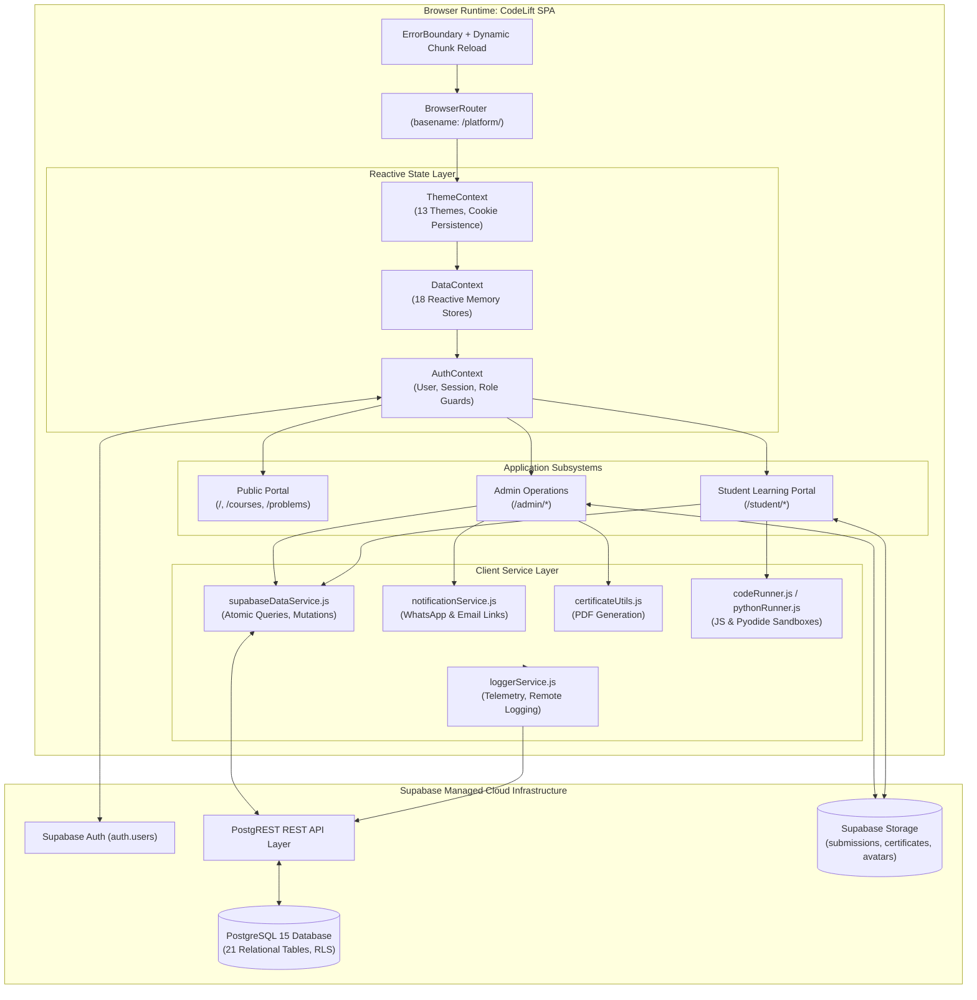
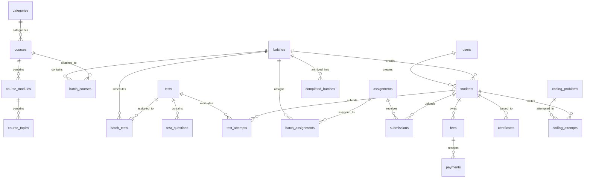

# CodeLift Platform — Comprehensive Technical Documentation & Architecture Reference

> **Version**: 1.9.0  
> **Target Audience**: Core Engineers, DevOps, System Architects, and Technical Maintainers  
> **Last Updated**: September 2026  
> **Repository**: `codelift-official/platform`  
> **Hosting & Deployment**: GitHub Pages SPA (`/platform/`) + Supabase PostgreSQL Backend  

---

## 1. Executive Architecture Summary

**CodeLift** is an enterprise-grade EdTech Institute & Learning Management Platform engineered as a high-performance **Single Page Application (SPA)** backed directly by **Supabase PostgreSQL**.

### Core Philosophy
1. **Direct Cloud Database (Supabase PostgreSQL)**: All persistent records—students, batches, curriculum, tests, submissions, fee invoices, code attempts, and credentials—reside in a hosted PostgreSQL 15+ database with Row-Level Security (RLS).
2. **Reactive Local State with Background Hydration**: The frontend maintains an optimistic, memory-first state layer (`DataContext.jsx`) that instantly renders UI mutations, atomically synchronizes with Supabase via `supabaseDataService.js`, and re-hydrates upon browser focus or authentication changes.
3. **Zero-Backend Architecture**: Standard transactions, query filters, joins, and file uploads execute directly against Supabase PostgREST & Storage endpoints, eliminating the cost and maintenance overhead of an intermediary Express/Node.js server.
4. **Institutional Branding & Conversion**: Combines a modern public storefront (curriculum previews, problem arena, WhatsApp deep-link enrollments) with high-density administrative operations and an interactive student learning workspace.

---

## 2. Technology Stack & Runtime Dependencies

| Layer | Technologies / Libraries | Purpose & Details |
| :--- | :--- | :--- |
| **Core Framework** | React `^18.3.1`, React DOM `^18.3.1` | Concurrent rendering, functional hooks, strict mode |
| **Build & Bundler** | Vite `^6.0.7`, `@vitejs/plugin-react` | ES module dev server, production tree-shaking, hash chunking |
| **Routing** | React Router DOM `^6.28.0` | Client-side routing with GitHub Pages SPA basename `/platform/` |
| **Database & Auth** | `@supabase/supabase-js` `^2.109.0`, PostgreSQL | Relational storage, PostgREST API, JWT authentication, Storage buckets |
| **UI Framework & Design** | Bootstrap `^5.3.3`, `react-bootstrap` `^2.10.9` | Responsive 12-column grid, modular modals, form controls |
| **Typography & Styling** | Custom CSS (`index.css`), CSS Custom Properties | 13 dynamic themes, dark nebula modes, glassmorphism, responsive utilities |
| **Motion & Visuals** | `framer-motion` `^13.2.0`, `canvas-confetti` | Page transitions, modal spring physics, completion micro-animations |
| **Particle Backgrounds** | `@tsparticles/react`, `@tsparticles/slim`, `seinx-nn-canvas-animation` | Neural interactive hero background, dynamic canvas nodes |
| **Forms & Validation** | `react-hook-form` `^7.54.2`, `zod` `^3.24.1` | Typed schema validation and controlled form state |
| **Notifications** | `react-hot-toast` `^2.5.1` | Rich promise toasts, dismissible alerts |
| **Icons & Media** | `react-icons` `^5.7.0` | FontAwesome (`Fa*`), SimpleIcons (`Si*`), Feather (`Fi*`) |
| **Content & Document** | `react-markdown` `^9.0.3`, `html2canvas`, `jspdf` | Curriculum markdown rendering, client-side PDF certificate generation |
| **Database CLI Tooling** | `pg` `^8.23.0` | Node.js driver for running raw SQL migrations via `db-migrate.js` |

---

## 3. High-Level Architecture Diagram



---

## 4. Directory & File Organization

```text
d:/PROD/CodeLift/
├── .env.example                       # Reference environment variables
├── .env.local                         # Local environment secrets (ignored by git)
├── index.html                         # SPA mount point with meta tags & preloader
├── package.json                       # Scripts, dependencies, version info (1.9.0)
├── vite.config.js                     # Vite build configuration, base URL /platform/
├── vercel.json                        # Optional Vercel SPA routing redirects
├── supabase/
│   └── migrations/                    # 10 Sequential SQL migrations
│       ├── 001_initial_schema.sql
│       ├── 002_refinements_and_archival.sql
│       ├── 003_completed_batches_snapshot.sql
│       ├── 004_update_admin_and_student_auth.sql
│       ├── 005_coding_arena.sql
│       ├── 006_reset_requested_flag.sql
│       ├── 007_error_logs.sql
│       ├── 008_student_concessions_and_policies.sql
│       ├── 009_tests_and_batch_assessments_policies.sql
│       └── 010_courses_and_categories_policies.sql
├── scripts/                           # Maintenance and build utilities
│   ├── bump-version.js                # Auto-increments build timestamp before build
│   ├── clean-db.js                    # Admin script: wipes seeded records, keeps schema & admin
│   ├── copy-404.js                    # Generates dist/404.html for GitHub Pages routing
│   ├── db-migrate.js                  # Direct PostgreSQL migration execution runner
│   ├── export-supabase-to-json.js     # Exports database snapshot to backups/
│   ├── migrate-json-to-supabase.js    # Seeds database from static JSON
│   └── seed-admin.js                  # Ensures master admin account exists in Supabase
├── test/                              # Automated regression test suite
│   ├── run-all-tests.js               # Master test runner (62 assertions, 9 suites)
│   ├── entity-associations.test.js    # Batch attachment/detachment tests
│   ├── course-import-export.test.js   # JSON import/export & quiz evaluation
│   ├── fee-management.test.js         # Multi-installment fee balance tests
│   ├── cookie-theme-persistence.test.js# Cookie resolution & fallback tests
│   ├── verify-theme-consistency.js    # Theme CSS tokens & contrast tests
│   ├── batch-course-and-fee.test.js   # Batch courses, fees, mobile layouts
│   ├── enrollment-journey-and-marketplace.test.js # WhatsApp enrollment tests
│   ├── problem-solutions.test.js      # Arena editorials & challenge test cases
│   └── batch-management-and-quizzes.test.js # Safe batch delete & quizzes
├── public/                            # Static assets deployed directly
│   └── courses/cohort/                # Static cohort curriculum definitions
└── src/
    ├── App.jsx                        # Master routing table & ErrorBoundary
    ├── index.css                      # Global design system tokens, 13 themes
    ├── main.jsx                       # Entrypoint, preload listeners, error shields
    ├── config/
    │   ├── navigation.jsx             # Navigation tree configuration
    │   └── version.js                 # Exported platform version constants
    ├── contexts/
    │   ├── AuthContext.jsx            # Auth state, login/logout, role derivation
    │   ├── DataContext.jsx            # Master reactive store with 18 collections
    │   └── ThemeContext.jsx           # Theme state, cookie sync, CSS variables
    ├── services/
    │   ├── supabaseClient.js          # Configured @supabase/supabase-js client
    │   ├── supabaseDataService.js     # PostgREST query and mutation methods
    │   ├── loggerService.js           # Production telemetry & error logging
    │   ├── notificationService.js     # WhatsApp deep-link & email builder
    │   ├── certificateUtils.js        # PDF digital credential rendering
    │   └── pythonRunner.js            # In-browser Python runner via Pyodide
    ├── utils/
    │   ├── codeRunner.js              # JavaScript sandbox execution engine
    │   ├── cookieUtils.js             # RFC-compliant document.cookie helper
    │   ├── feeUtils.js                # Ledger calculations & status resolution
    │   └── themeUtils.js              # Theme tokens & contrast ratio calculation
    ├── components/
    │   ├── admin/                     # 21 Administrative management panels
    │   ├── student/                   # 17 Student LMS views & IDE
    │   └── common/                    # 37 Shared UI elements, radar, navigation
    └── pages/                         # Route level view components
```

---

## 5. Complete Database Schema (21 Tables)

The Supabase database runs PostgreSQL 15 with strict relational integrity, foreign key cascades, and row-level security.



### Table Definitions & Foreign Key Constraints

#### 1. `users`
- **Purpose**: System accounts (administrators and instructors).
- **Columns**: `id` (text PK), `email` (text unique), `full_name` (text), `role` (text: `'admin' | 'staff'`), `is_active` (boolean), `created_at` (timestamptz), `updated_at` (timestamptz).

#### 2. `students`
- **Purpose**: Enrolled student profiles and credentials.
- **Columns**: `id` (text PK), `email` (text unique), `name` (text), `phone` (text), `batch_id` (text FK -> `batches.id` on delete set null), `status` (text: `'ACTIVE' | 'SUSPENDED' | 'COMPLETED'`), `enrollment_date` (date), `total_fees` (numeric), `paid_fees` (numeric), `concession_amount` (numeric default 0), `concession_reason` (text), `reset_requested` (boolean default false), `created_at`, `updated_at`.

#### 3. `batches`
- **Purpose**: Cohort programs with scheduled start dates and capacities.
- **Columns**: `id` (text PK), `name` (text), `description` (text), `capacity` (integer default 30), `fee_amount` (numeric default 0), `start_date` (date), `is_active` (boolean default true), `is_completed` (boolean default false), `completed_at` (timestamptz), `archived_students` (jsonb default '[]'), `created_at`, `updated_at`.

#### 4. `categories`
- **Purpose**: Course classification domains (`cat-web`, `cat-python`, `cat-data`, `cat-core`).
- **Columns**: `id` (text PK), `name` (text), `slug` (text unique), `description` (text), `icon` (text), `created_at`.

#### 5. `courses`
- **Purpose**: Master course definitions (cohort bootcamps and specialized electives).
- **Columns**: `id` (text PK), `title` (text), `slug` (text unique), `description` (text), `category_id` (text FK -> `categories.id` on delete set null), `course_type` (text default `'elective'`), `price` (numeric default 0), `is_free` (boolean default false), `is_published` (boolean default true), `is_approved` (boolean default true), `thumbnail` (text), `promo_video` (text), `rating` (numeric default 5.0), `num_reviews` (integer default 0), `students_enrolled` (integer default 0), `created_at`, `updated_at`.

#### 6. `course_modules`
- **Purpose**: Curriculum chapters within a course.
- **Columns**: `id` (text PK), `course_id` (text FK -> `courses.id` on delete cascade), `title` (text), `order_index` (integer default 0), `created_at`.

#### 7. `course_topics`
- **Purpose**: Individual lessons with markdown documentation and video embed URLs.
- **Columns**: `id` (text PK), `module_id` (text FK -> `course_modules.id` on delete cascade), `title` (text), `video_url` (text), `content_md` (text), `order_index` (integer default 0), `created_at`.

#### 8. `batch_courses` (Junction)
- **Purpose**: Many-to-many relationship linking courses to batches.
- **Columns**: `batch_id` (text FK -> `batches.id` on delete cascade), `course_id` (text FK -> `courses.id` on delete cascade), `created_at`. PK (`batch_id`, `course_id`).

#### 9. `tests`
- **Purpose**: Assessment exams and MCQ quizzes.
- **Columns**: `id` (text PK), `title` (text), `description` (text), `duration_minutes` (integer default 30), `passing_percentage` (integer default 75), `is_active` (boolean default true), `created_at`, `updated_at`.

#### 10. `test_questions`
- **Purpose**: Individual multiple-choice questions within a test.
- **Columns**: `id` (text PK), `test_id` (text FK -> `tests.id` on delete cascade), `question_text` (text), `options` (jsonb: array of strings), `correct_option` (integer: 0-indexed), `explanation` (text), `order_index` (integer default 0), `created_at`.

#### 11. `test_attempts`
- **Purpose**: Student exam submissions with calculated scores and pass/fail ratings.
- **Columns**: `id` (text PK), `test_id` (text FK -> `tests.id` on delete cascade), `student_id` (text FK -> `students.id` on delete cascade), `batch_id` (text FK -> `batches.id` on delete set null), `answers` (jsonb), `score` (integer), `total_marks` (integer), `percentage` (numeric), `passed` (boolean), `rating` (text), `submitted_at` (timestamptz).

#### 12. `batch_tests` (Junction)
- **Purpose**: Links scheduled assessments to specific batches.
- **Columns**: `batch_id` (text FK -> `batches.id` on delete cascade), `test_id` (text FK -> `tests.id` on delete cascade), `created_at`. PK (`batch_id`, `test_id`).

#### 13. `assignments`
- **Purpose**: Practical coursework, projects, and coding problem statements.
- **Columns**: `id` (text PK), `title` (text), `description` (text), `instructions_md` (text), `due_date` (timestamptz), `max_score` (integer default 100), `created_at`, `updated_at`.

#### 14. `batch_assignments` (Junction)
- **Purpose**: Links coursework to specific batches.
- **Columns**: `batch_id` (text FK -> `batches.id` on delete cascade), `assignment_id` (text FK -> `assignments.id` on delete cascade), `created_at`. PK (`batch_id`, `assignment_id`).

#### 15. `submissions`
- **Purpose**: Student project uploads, GitHub links, and evaluation marks.
- **Columns**: `id` (text PK), `assignment_id` (text FK -> `assignments.id` on delete cascade), `student_id` (text FK -> `students.id` on delete cascade), `batch_id` (text FK -> `batches.id` on delete set null), `submission_url` (text), `notes` (text), `score` (numeric), `feedback` (text), `status` (text: `'SUBMITTED' | 'GRADED' | 'RESUBMIT'`), `submitted_at`, `graded_at`.

#### 16. `fees`
- **Purpose**: Student billing invoices and tuition obligation records.
- **Columns**: `id` (text PK), `student_id` (text FK -> `students.id` on delete cascade), `batch_id` (text FK -> `batches.id` on delete set null), `amount` (numeric), `paid_amount` (numeric default 0), `due_date` (date), `status` (text: `'PENDING' | 'PARTIAL' | 'PAID'`), `created_at`, `updated_at`.

#### 17. `payments`
- **Purpose**: Verified installment receipts (UPI, Bank Transfer, Cash).
- **Columns**: `id` (text PK), `fee_id` (text FK -> `fees.id` on delete cascade), `student_id` (text FK -> `students.id` on delete cascade), `amount` (numeric), `payment_method` (text), `transaction_ref` (text), `receipt_no` (text), `paid_at` (timestamptz), `created_at`.

#### 18. `certificates` & `certificate_templates`
- **Purpose**: Digital graduation credentials and WYSIWYG certificate templates.
- **Columns**:
  - `certificate_templates`: `id` (text PK), `name` (text), `layout_config` (jsonb), `is_default` (boolean), `created_at`.
  - `certificates`: `id` (text PK), `student_id` (text FK -> `students.id` on delete cascade), `batch_id` (text FK -> `batches.id` on delete set null), `course_id` (text), `certificate_no` (text unique), `template_id` (text), `issued_at` (timestamptz).

#### 19. `coding_problems` & `coding_attempts`
- **Purpose**: LeetCode-style Problem Arena algorithmic and SQL challenges.
- **Columns**:
  - `coding_problems`: `id` (text PK), `title` (text), `slug` (text unique), `difficulty` (text: `'Easy' | 'Medium' | 'Hard'`), `category` (text), `description_md` (text), `starter_code` (jsonb), `solution_code` (text), `test_cases` (jsonb), `hints` (jsonb), `order_index` (integer).
  - `coding_attempts`: `id` (text PK), `problem_id` (text FK -> `coding_problems.id` on delete cascade), `student_id` (text), `language` (text), `code` (text), `status` (text: `'ACCEPTED' | 'WRONG_ANSWER' | 'RUNTIME_ERROR'`), `passed_cases` (integer), `total_cases` (integer), `execution_time_ms` (integer), `attempted_at`.

#### 20. `completed_batches`
- **Purpose**: Historical archival records for completed cohorts preserving student rosters and grades.
- **Columns**: `id` (text PK), `original_batch_id` (text), `name` (text), `start_date` (date), `end_date` (date), `completed_at` (timestamptz), `student_ids` (jsonb), `test_ids` (jsonb), `created_at`.

#### 21. `error_logs`
- **Purpose**: Client-side production telemetry and unhandled exception tracker.
- **Columns**: `id` (text PK), `message` (text), `stack` (text), `user_agent` (text), `url` (text), `user_id` (text), `severity` (text default `'error'`), `created_at` (timestamptz default now()).

---

## 6. Authentication, Security & Permissions Model

### Authentication Architecture
1. **Dual Login System (`/login` & `/admin/login`)**:
   - **Administrators**: Authenticate via Supabase Auth (`supabase.auth.signInWithPassword({ email, password })`). Upon authentication, role is checked against `public.users`.
   - **Students**: Authenticate either via Supabase Auth credentials or through verified student identifier lookups against `public.students`.
2. **Role-Based Guards**:
   - `RequireAdmin` (`src/pages/AdminRoutes.jsx`): Intercepts all `/admin/*` routes. If `user.role !== 'admin'`, navigates immediately to `/admin/login`.
   - `StudentLayout` (`src/components/student/StudentLayout.jsx`): Protects `/student/*` routes and injects student portal sidebar and active batch context.

### Row-Level Security (RLS) Strategy
To support a client-first SPA architecture while maintaining integrity, tables are configured with RLS policies:
- **Public Select Policies**: Entities required for public viewing (`courses`, `course_modules`, `course_topics`, `categories`, `coding_problems`) have open `FOR SELECT USING (true)` policies.
- **Operational Policies (Migrations 008, 009, 010)**: Tables mutated by administrative actions and student submissions (`students`, `batches`, `courses`, `tests`, `assignments`, `submissions`, `fees`, `payments`, `error_logs`) are protected by explicit RLS policies granting full access (`FOR ALL USING (true) WITH CHECK (true)`).
- **Cascading Deletion Rules**: All foreign keys utilize `ON DELETE CASCADE` (e.g. deleting an assignment deletes all submissions and junction links; deleting a batch unassigns students and detaches tests).

---

## 7. State Management & Hydration Lifecycle

`DataContext.jsx` is the operational nerve center of the application, managing 18 reactive state collections:

```typescript
// Core Collections in DataContext
const [users, setUsers] = useState([]);
const [students, setStudents] = useState([]);
const [categories, setCategories] = useState([]);
const [courses, setCourses] = useState([]);
const [batches, setBatches] = useState([]);
const [fees, setFees] = useState([]);
const [payments, setPayments] = useState([]);
const [tests, setTests] = useState([]);
const [testAttempts, setTestAttempts] = useState([]);
const [assignments, setAssignments] = useState([]);
const [submissions, setSubmissions] = useState([]);
const [certificates, setCertificates] = useState([]);
const [certificateTemplates, setCertificateTemplates] = useState([]);
const [completedBatches, setCompletedBatches] = useState([]);
const [codingProblems, setCodingProblems] = useState([]);
const [codingAttempts, setCodingAttempts] = useState([]);
```

### Hydration Sequence
1. **Application Mount**: `useEffect` initiates `syncFromSupabase()` on boot.
2. **Parallel Hydration (`supabaseDataService.fetchAllData()`)**: Issues a single `Promise.all` across all 21 tables, reassembles junction records (`batch_courses`, `batch_tests`, `batch_assignments`), and populates React state.
3. **Window Focus Sync**: An event listener on `window.addEventListener('focus', syncFromSupabase)` automatically re-syncs state when switching back to the CodeLift tab, ensuring multi-tab consistency.
4. **Auth State Change**: Listens to `supabase.auth.onAuthStateChange()` to refresh state on login/logout.

### Optimistic Mutation & Rollback Pattern
Every mutation function follows an optimistic-update with rollback design:

```javascript
const addCourse = async (courseData) => {
  // 1. Optimistically update local state for instant UI response
  const newCourse = { ...courseData, id: genId('course') };
  setCourses((prev) => [newCourse, ...prev]);

  // 2. Persist to Supabase
  try {
    await supabaseDataService.addCourse(newCourse);
  } catch (err) {
    console.error('[DataContext] addCourse failed:', err);
    // 3. Rollback local state on database rejection
    setCourses((prev) => prev.filter((c) => c.id !== newCourse.id));
    throw err; // Propagate to caller for toast notification
  }
  return newCourse;
};
```

---

## 8. Deep Dives: Critical Subsystems

### 8.1 Course Management & JSON Import/Export Engine
- **JSON Import Structure**: Supports full course schemas containing nested `modules`, `topics`, and `quizQuestions`.
- **Foreign Key Safe Fallback**: Automatically validates `categoryId` against existing `categories` rows (falling back to `'cat-web'` or `null`) to eliminate Postgres `23503` constraint errors.
- **Slug De-duplication**: Generates URL-friendly slugs; if a collision occurs, appends incrementing numeric suffixes (`slug-1`, `slug-2`).
- **Catalog Filtering**: `CourseManager.jsx` provides pill filters (**All**, **Electives**, **Cohorts**) so that imported courses are immediately visible regardless of `courseType`.

### 8.2 Fee Management & Multi-Installment Ledger
- **Status Calculation**:
  - `PAID`: `paid_amount >= amount`
  - `PARTIAL`: `paid_amount > 0 && paid_amount < amount`
  - `PENDING`: `paid_amount === 0`
- **Concessions**: Student profiles track `concession_amount` and `concession_reason`. Net obligation is calculated as `(total_fees - concession_amount)`.
- **WhatsApp Receipts**: Automatically constructs encoded WhatsApp Web URLs with formatted invoice receipts, dates, transaction references, and remaining balances.

### 8.3 MCQ Test Engine & Auto-Grading
- **Scoring Algorithm**: Evaluates student selections against 0-indexed correct options.
- **Rating Bands**:
  - `100%`: `A+ (Outstanding)`
  - `85% - 99%`: `A (Excellent)`
  - `75% - 84%`: `B+ (Passed)`
  - `50% - 74%`: `C (Needs Review)`
  - `< 50%`: `F (Fail - Retake Required)`
- **Cross-Key Batch Matching**: Matches tests to students across `assignedBatchIds`, `batchIds`, and `batch.testIds`.

### 8.4 Zero-Table Password Reset Flow
- **Mechanism**: When a student requests a password reset on the login page, CodeLift flags `reset_requested = true` directly on `public.students`.
- **Admin Resolution**: The admin sees pending tickets dynamically derived from `students.filter(s => s.reset_requested)`. Clicking "Resolve" resets the password to a default (`codelift123`) and clears the flag. Eliminates extra password ticket tables.

### 8.5 Cookie-Based Theme System
- **13 Themes**: `dark-nebula`, `dracula`, `monokai`, `nord`, `cyberpunk`, `emerald`, `sapphire`, `amethyst`, `sunset`, `light-clean`, `corporate`, `minimal`, `midnight`.
- **Persistence Resolution**:
  1. RFC-compliant browser cookie `cl_theme` (prioritized for cross-subdomain compatibility and SSR readiness).
  2. Fallback to `localStorage.getItem('codelift_theme')`.
  3. Default fallback to `dark-nebula`.

---

## 9. Testing & Quality Assurance Framework

CodeLift incorporates a test suite executed via `npm test`:

```bash
npm test # Runs node test/run-all-tests.js
```

### Test Suites Overview (62 Passing Assertions)
1. **Entity Associations & Batch Synchronization** (`test/entity-associations.test.js`):
   - Detaching a course from a batch immediately removes it from student view.
   - Attaching a course immediately reveals it to batch students.
   - Student batch transfers update curriculum access.
2. **Course Import/Export & Quiz Evaluation** (`test/course-import-export.test.js`):
   - JSON parsing with multi-level modules, topics, and quizzes.
   - Unique ID generation during import.
   - Pass/fail percentage thresholds and rating calculation.
3. **Fee Recording & Ledger Synchronization** (`test/fee-management.test.js`):
   - Partial installment updates to "Partial".
   - Full installment updates to "Paid".
   - Dynamic balance re-calculation on fee record edits or deletions.
4. **Cookie Theme Persistence & Resolution** (`test/cookie-theme-persistence.test.js`):
   - Cookie setting with HTTPS Secure flags.
   - Priority resolution: Cookie > localStorage > dark-nebula.
5. **UI Theme Consistency** (`test/verify-theme-consistency.js`):
   - Definition of all 13 canonical themes.
   - Contrast ratio and token integrity across sidebars, navbars, and buttons.
6. **Batch Course Attachment, Fees & Mobile UI** (`test/batch-course-and-fee.test.js`):
   - Atomic attachment and detachment verification.
   - Mobile radar card styling assertions.
7. **Enrollment Journey & Marketplace UI** (`test/enrollment-journey-and-marketplace.test.js`):
   - WhatsApp enrollment deep-link validation.
   - Clean professional message formatting (zero emojis).
8. **Problem Arena Editorials** (`test/problem-solutions.test.js`):
   - Completeness of step-by-step algorithms, complexity analyses, and official solutions.
9. **Batch Management, Safe Deletion & Course Quizzes** (`test/batch-management-and-quizzes.test.js`):
   - Cascade unlinking of students, courses, tests, and assignments on batch deletion.
   - Error logger recursion shields.

---

## 10. Build, Deployment & Operations Runbook

### Build Pipeline
CodeLift builds via Vite into the `dist/` directory with automated GitHub Pages SPA configuration:

```bash
npm run build
```
Under the hood, this executes:
1. `node scripts/bump-version.js`: Updates `BUILD_TIMESTAMP` in `src/config/version.js`.
2. `vite build`: Transpiles, bundles, and hashes assets into `dist/`.
3. `node scripts/copy-404.js`: Copies `dist/index.html` to `dist/404.html`. This ensures GitHub Pages routes all deep URLs (e.g. `/platform/admin/courses`) back to the SPA router instead of returning a 404.

### GitHub Actions CI/CD
On every push to `main`, `.github/workflows/deploy.yml`:
1. Checks out repository.
2. Sets up Node.js 18.x.
3. Installs dependencies (`npm ci`).
4. Runs full regression tests (`npm test`).
5. Builds production bundle (`npm run build`).
6. Deploys `dist/` artifact to GitHub Pages.

### Production Dynamic Chunk Error Handling
When a new build is deployed, Vite chunk hashes change. If a user has an older version open, clicking lazy-loaded routes can throw `Failed to fetch dynamically imported module`. CodeLift handles this in `src/main.jsx`:
- Listens for `vite:preloadError`.
- Employs a sessionStorage guard (`chunk_reload_guard`) to force a clean single reload to pull the new version without infinite reload loops.

### Maintenance CLI Commands

| Command | Script | Purpose |
| :--- | :--- | :--- |
| `npm run db:migrate` | `scripts/db-migrate.js` | Executes unapplied SQL migrations in `supabase/migrations/` |
| `npm run db:status` | `scripts/db-migrate.js --status` | Shows migration status against `schema_migrations` table |
| `npm run db:backup` | `scripts/export-supabase-to-json.js` | Exports complete database snapshot to `backups/` directory |
| `npm run db:clean` | `scripts/clean-db.js` | Empties all tables and storage buckets while preserving admin user |
| `npm run db:seed` | `scripts/migrate-json-to-supabase.js`| Seeds database from local JSON files |

---

## 11. Developer Onboarding & Troubleshooting Guide

### Local Development Setup
1. **Clone repository**:
   ```bash
   git clone https://github.com/codelift-official/platform.git
   cd platform
   ```
2. **Install dependencies**:
   ```bash
   npm install
   ```
3. **Configure environment**:
   ```bash
   cp .env.example .env.local
   ```
   Fill in `VITE_SUPABASE_URL` and `VITE_SUPABASE_ANON_KEY`. For migration CLI access, also supply `DATABASE_URL` (direct PostgreSQL connection string) and `SUPABASE_SERVICE_ROLE_KEY`.
4. **Run development server**:
   ```bash
   npm run dev
   ```
   Access at `http://localhost:5173/platform/`.

### Common Gotchas & Troubleshooting

#### 1. "Row violates foreign key constraint" on Course Insert (`23503`)
- **Cause**: Course references a `category_id` that does not exist in `categories`.
- **Solution**: Ensure Migration 010 is applied (`npm run db:migrate`). Migration 010 seeds the 4 standard categories (`cat-web`, `cat-python`, `cat-data`, `cat-core`). In `DataContext.jsx`, `createCourseFromJSON` automatically validates categories before insert.

#### 2. "New row violates row-level security policy" (`42501`)
- **Cause**: RLS policy on the target table strictly requires `is_admin()`, rejecting anon client writes.
- **Solution**: Check migrations 008, 009, and 010 which establish open `FOR ALL USING (true)` operational policies for client-driven workflows.

#### 3. Course Vanishing on Refresh
- **Cause**: Asynchronous mutation was not awaited or error was swallowed, causing optimistic local state to be overwritten during `syncFromSupabase()`.
- **Solution**: Always `await` mutations in `DataContext.jsx` and propagate errors to the calling UI component so failures are surfaced to the user via toast notifications.

#### 4. GitHub Pages Returns 404 on Refreshing Deep Routes
- **Cause**: Missing `404.html` fallback.
- **Solution**: Ensure `node scripts/copy-404.js` runs as part of the build command (`npm run build`). Verify `dist/404.html` exists.
